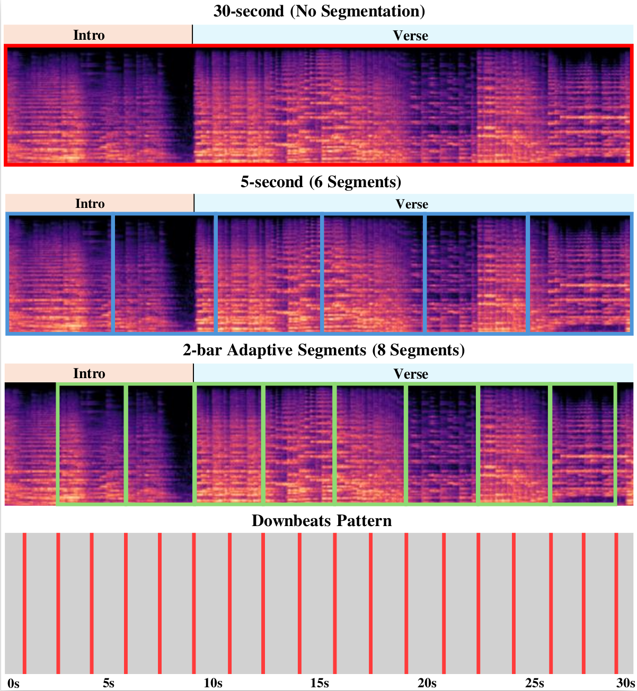

# FROM FIXED WINDOWS TO MUSICAL BARS: STRUCTURE-AWARE PREPROCESSING IN MIR

Paper Link : TBD

Seonghyeon Go, Yumin Kim., A comparative study of temporal segmentation methods for music information retrieval (MIR), investigating the impact of musically-informed preprocessing on genre classification performance.

## Overview

This project compares three segmentation approaches:
- **Method 1**: 30-second full audio clips
- **Method 2**: Fixed 5-second segments 
- **Method 3**: Structure-aware 2-bar segments based on BPM and musical structure




The study demonstrates that structure-aware preprocessing can achieve competitive performance while providing musically meaningful analysis units.

## Setup

**Environment:**
```
conda create -n music_classification python=3.10
conda activate music_classification
```

**Dependencies:**
```
# Install Natten (required)
# Follow: https://github.com/mir-aidj/all-in-one
# manual madmom install, pip install git+https://github.com/CPJKU/madmom. 
# Because of Natten and all-in-one deprecation, carefully follow https://github.com/mir-aidj/all-in-one/pull/27.

we recommend to install Natten 0.17.5, and
pip install git+https://github.com/govi218/all-in-one.git@gov/update-deprecated.

pip install -r requirements.txt
```


## Data Preparation
```
python gtzan.py
python main.py
python process.py
```

Creates:
- `Data/` folder (GTZAN dataset)
- `gtzan_analysis/` folder (downbeat tracking)
- `gtzan_preprocessed/` folder (segmented audio)

## Method 1: 30-second Audio
```
python method1_train.py --feature mel --model simple_cnn --epochs 50
python method1_train.py --feature cqt --model simple_cnn --epochs 50
python method1_train.py --feature audio --model mert --epochs 50
```

## Method 2: 5-second Segments
```
python train.py --method method2_5sec --feature mel --model simple_cnn --epochs 50
python train.py --method method2_5sec --feature cqt --model simple_cnn --epochs 50
python train.py --method method2_5sec --feature audio --model mert --epochs 50
```

## Method 3: 2-bar Segments
```
python train.py --method method3_2bar --feature cqt --model simple_cnn --epochs 50
python train.py --method method3_2bar --feature audio --model mert --epochs 50
```

## Options

**Features:** mel, cqt  
**Models:** simple_cnn, mert  
**Args:** --epochs, --batch_size, --learning_rate

**Note:** ConvNeXt training failed due to slow convergence with pretrained=False.

